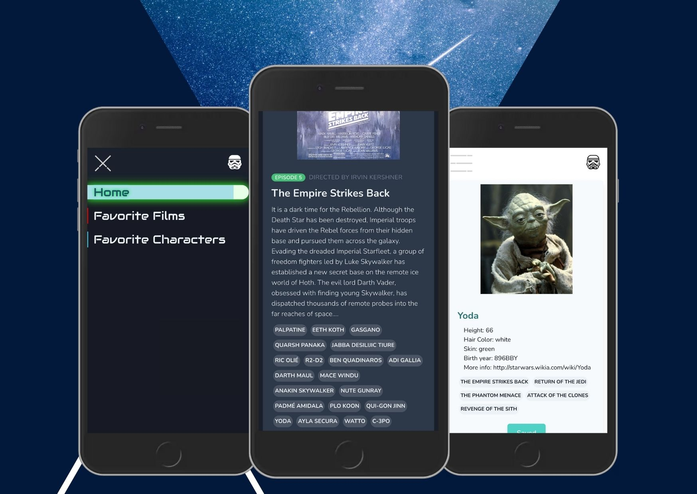

# Femtasy tech challenge

A simple front React application that consumes the Star Wars API and shows the content requested by the user.
Browse through a collection of films on the home page, select your favorite films and characters.
Find all baby yoda's and try out the different color modes.

This project was bootstrapped with [Create React App](https://github.com/facebook/create-react-app).

  

## Get Started

To run this project locally, you have two options:

### `cd client && npm i && npm start`

Runs the app in the development mode. 
Open [http://localhost:3000](http://localhost:3000) to view it in the browser.

### `npm i && npm start`

You also have the option to run the latest build folder from the node server.
Open [http://localhost:4002](http://localhost:4002) to view it in the browser.

click here for a [live demo](https://swapi-fem.herokuapp.com/)

